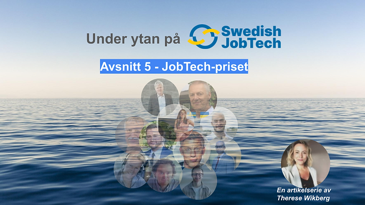

Den här texten publicerades först på [SwedishJobTech.se](https://www.swedishjobtech.se/post/under-ytan-p%C3%A5-swedish-jobtech-jobtech-priset)

Detta är en fortsättning i Swedish JobTechs artikelserie om verksamheten och eldsjälarna som driver den digitala och datadrivna tekniken för att förbättra matchningen på arbetsmarknaden. Jag heter Therese Wikberg och har under hösten 2023 intervjuat några av dessa och de utskott som de arbetar inom.

De fem olika utskotten som arbetar med sakfrågorna hos Swedish JobTech heter Startup, Analys, Operativa, Datadrivet lärande och JobTech-priset som vi ska få läsa om nu. 

## Hej Mattias, vem är du och varför är du engagerad i Swedish JobTech?

© Licens: Kristina Alexandersson, Creative Commons Erkännande-DelaLika 4.0

Jag heter Mattias Axell och är grundare av ideella föreningen Open Knowledge Sweden och plattformen Handlingar.se. Jag jobbar som utbildare, rådgivare och affärsutvecklare på MetaSolutions som utvecklar EntryScape och är konsult i Västra Götalandregionens projekt Nationell Dataverkstad som standardiserar datamängder.

"*Jag är engagerad i Swedish JobTech eftersom det är en av få bransch- och användarföreningar som har fokus på användning och uppmuntran av datadelning.*"

Föreningen visar även på nyttorna med mer öppna data och öppen kunskap och efterfrågar det offentligt. Om fler hade tillgång till data och information skulle fler kunna hjälpa till att stävja problemen med arbetslöshet, utbrändhet och utanförskap.

## Vad är syftet med utskottet JobTech-priset?

Syftet med utskottet är att nominera förslag till vinnare av JobTech-priset och uppmuntra till användning och utveckling av data kopplat till arbetsmarknaden. Styrelsen utser sedan årets vinnare utifrån de nomineringar vi gjort.

## Vad har ni för planer framöver?

Vi har precis annonserat årets vinnare för fjärde året så nu siktar vi på att se vilka som kan bli aktuella för prisen 2024.

Alla välkomna att nominera kandidater till priset i kategorierna Akademi och Bästa tjänst. Både privatpersoner och organisationer kan nomineras och du gör det enklast via mail Olle Lundin, grundare för Swedish JobTech på olle.lundin@swedishjobtech.se. Alla tidigare vinnare presenterar vi JobTech-priset.

## Om läsaren vill engagera sig i ert arbete, hur kan de bidra?

Jag uppmuntrar alla att medverka till ökad dataanvändning genom att begära ut data och handlingar relaterat via handlingar.se med stöd av offentlighetsprincipen och nya datalagen från förra året. Det kan vara underlag till nya insikter, innovationer och initiativ för en bättre arbetsmarknad! Läsare kan också tipsa oss om engagemang och initiativ som kan vara av intresse för utskottet att ta del av, för utskottet lägger även in sina egna nomineringar.  